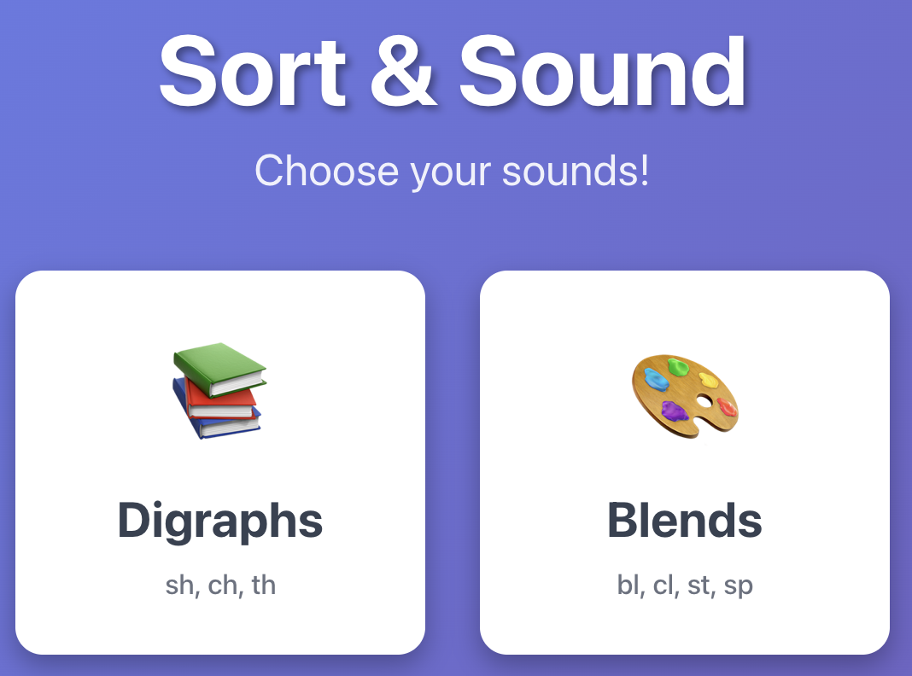

# Sort & Sound - Phonics Game

A drag-and-drop phonics game for teaching digraphs and blends to early readers (age 4+). Built for practicing systematic, explicit phonics instruction aligned with the University of Florida Literacy Institute (UFLI) program.

## Screenshots

**Difficulty Selection**



**Game Play**


## Quick Start

```bash
npm install
npm run dev
```

Open http://localhost:5173

## How It Works

1. Choose **Digraphs** (sh, ch, th) or **Blends** (bl, cl, st, sp, br, gr)
2. Drag picture cards to matching sound buckets
3. Hear words spoken when picking up cards
4. Get instant feedback (✓ correct / ✗ try again)
5. Complete 3 rounds per category

## Design Principles

**Phonics-First**: Sound patterns drive the entire game structure. Words are organized by phonemes, not themes.

**Audio Reinforcement**: Web Speech API speaks words on card pickup, connecting written patterns to spoken sounds without external files.

**Positive Feedback Loop**: No failure states, unlimited retries. Incorrect placements bounce back gently; correct ones lock in with celebration.

**Cognitive Load Management**:
- Large touch targets (80px+ cards, 120px+ buckets)
- High contrast colors
- One task at a time
- 6-8 words per round (working memory limit)

**Montessori-Style Self-Correction**: Visual and audio feedback is immediate. Children discover correct patterns through interaction, not instruction.

**Progressive Difficulty**: Start with 2-bucket sorts (sh vs ch), advance to 3-bucket (sh vs ch vs th), mixing digraphs and blends.

## Tech Stack

- React + Vite (fast dev, simple build)
- @dnd-kit/core (touch-friendly drag & drop)
- Web Speech API (no audio files)
- Pure CSS animations (no heavy libraries)

## File Structure

```
src/
├── App.jsx                  # Game orchestration & state
├── components/
│   ├── DifficultySelect.jsx # Start screen
│   ├── PictureCard.jsx      # Draggable cards with audio
│   ├── SortingBucket.jsx    # Drop zones
│   ├── ScoreDisplay.jsx     # Progress tracker
│   └── RoundComplete.jsx    # Celebration screen
├── data/
│   └── wordSets.js          # 48 words across 6 rounds
├── hooks/
│   └── useAudio.js          # Web Speech API wrapper
└── styles/
    └── game.css             # Child-friendly UI
```

## Adding More Content

Edit `src/data/wordSets.js` to add rounds:

```javascript
{
  id: 'fl-vs-pl',
  buckets: ['fl', 'pl'],
  words: [
    { id: 'fl1', word: 'flower', sound: 'fl', emoji: '🌸' },
    { id: 'pl1', word: 'plane', sound: 'pl', emoji: '✈️' },
    // ...
  ]
}
```

## Browser Support

Best on Chrome/Safari (full Web Speech API support). Firefox has limited voices but works.
